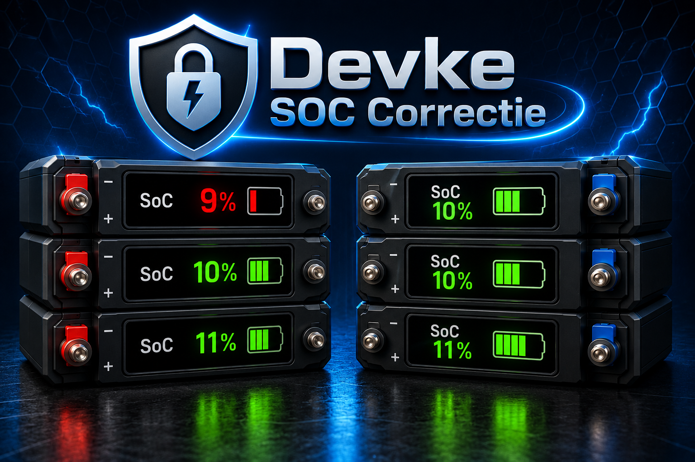

**Devke SoC Correctie Zendure**

De automatisering Devke SoC Correctie Zendure bewaakt de laagste laadstatus (SoC) van alle beschikbare Zendure AC-batterijen en grijpt in wanneer het systeem onder een veilige ondergrens dreigt te komen.

De basis van de logica is een dynamische sensor (Zendure Laagste SoC) die automatisch de laagste beschikbare SoC bepaalt uit alle herkende batterijen. Het aantal batterijen is daarbij volledig flexibel. Nieuwe batterijen worden automatisch meegenomen en ontbrekende of tijdelijk niet-beschikbare batterijen worden uitgesloten zonder invloed op de berekening.

Werking van de bescherming

Wanneer de laagste SoC onder de ingestelde minimumgrens komt, activeert de automatisering een beschermingsmechanisme. Dit gebeurt ook als het systeem op dat moment handmatig is ingesteld.

In dat geval:

- wordt de huidige modus (bijvoorbeeld Handmatig) tijdelijk opgeslagen
- wordt de bestaande configuratie van het systeem bewaard
- schakelt de automatisering het systeem naar een gecontroleerde handmatige beschermingsmodus
- wordt een vast laadvermogen ingesteld om verdere daling van de SoC te voorkomen

Hierdoor kan de SoC-protectie ook ingrijpen wanneer je zelf bewust handmatig aan het sturen bent, omdat de prioriteit altijd veiligheid van de batterijstatus is.

Herstel van de situatie

Zodra alle batterijen weer boven de doelgrens komen:

- wordt de oorspronkelijke modus hersteld (bijvoorbeeld terug naar Handmatig of Automatisch zoals opgeslagen)
- wordt de vorige synchronisatie- of laadstatus teruggezet -
- en neemt het systeem weer normale aansturing over zonder verdere interventie

Robuustheid

De automatisering is ontworpen om robuust te functioneren bij:

Home Assistant herstarts
tijdelijke onbeschikbaarheid van individuele batterijen
wisselende aantallen batterijen
dynamische SoC-waarden tijdens correcties of herkalibratie

De laagste SoC wordt altijd opnieuw berekend zodra data weer beschikbaar is, waardoor de bescherming zichzelf automatisch herstelt zonder handmatige acties.

Wat heb je nodig?

Voor deze automatisering wordt gebruikgemaakt van de Gielz automatiseringstructuur in Home Assistant in combinatie met de Proxy-oplossing van Gast777. Deze setup maakt het mogelijk om meerdere Zendure batterijen dynamisch en schaalbaar aan te sturen. Let op! Synchroon Laden optie (add-on bij Gast777) opnemen in de Proxy integratie.

Beschrijving gebruikte sensoren:

| Entiteit                                                    | Type            | Informatie                                                                                                                                                                   |
| ----------------------------------------------------------- | --------------- | ---------------------------------------------------------------------------------------------------------------------------------------------------------------------------- |
| `sensor.zendure_laagste_soc`                                | Template Sensor | Berekent automatisch de laagste SoC (%) van alle beschikbare Zendure batterijen. Deze sensor wordt gebruikt als referentie voor de SoC-correctie.                            |
| `input_number.zendure_batterij_soc_grens_minimum`           | Input Number    | Minimale toegestane SoC (%). Zodra de laagste batterij hieronder komt, wordt een correctielading gestart.                                                                    |
| `input_number.zendure_batterij_soc_doel_grens`              | Input Number    | Doel-SoC (%) waarnaar geladen wordt tijdens een SoC-correctie. Zodra deze waarde bereikt is, stopt de correctielading.                                                       |
| `input_number.zendure_soc_correctie_laadvermogen`           | Input Number    | Het laadvermogen (W) dat gebruikt wordt tijdens een SoC-correctie.                                                                                                           |
| `input_boolean.zendure_soc_protectie_lock`                  | Input Boolean   | Interne status die aangeeft of een SoC-correctie momenteel actief is.                                                                                                        |
| `input_text.zendure_previous_mode_soc_protectie`            | Input Text      | Slaat de actieve Zendure modus op voordat de SoC-correctie start, zodat deze later hersteld kan worden.                                                                      |
| `input_text.zendure_previous_synchroon_laden_soc_protectie` | Input Text      | Slaat de status van synchroon laden op voordat de SoC-correctie start, zodat deze later hersteld kan worden.                                                                 |
| `counter.zendure_soc_bescherming_bijladen`                  | Counter         | Houdt bij hoe vaak een SoC-correctie is gestart.                                                                                                                             |
| `input_select.zendure_2400_ac_modus_selecteren`             | Input Select    | Zendure bedrijfsmodus. Onderdeel van de Gielz Zendure integratie. De automatisering schakelt deze tijdelijk naar **Handmatig** tijdens een SoC-correctie.                    |
| `input_number.zendure_2400_ac_handmatig_vermogen`           | Input Number    | Handmatig laad-/ontlaadvermogen van de Zendure installatie. Onderdeel van de Gielz Zendure integratie.                                                                       |
| `sensor.dynamisch_duurste_periode`                          | Sensor          | Geeft aan of het huidige tijdsblok behoort tot de duurste energieprijzen. Onderdeel van de Gielz Zendure integratie. Tijdens dure periodes wordt geen SoC-correctie gestart. |
| `switch.synchroon_laden`                                    | Switch          | Zendure synchronisatie-optie waarmee alle batterijen gelijktijdig geladen kunnen worden tijdens een SoC-correctie.                                                           |

Installatie

**Stap 1 – Installeer de Zendure integratie van Gielz**

Installeer eerst de Zendure Home Assistant integratie van Gielz:

GitHub: https://github.com/Gielz1986/Zendure-HA-zenSDK

Controleer of de volgende entiteiten beschikbaar zijn:

input_select.zendure_2400_ac_modus_selecteren
input_number.zendure_2400_ac_handmatig_vermogen
sensor.dynamisch_duurste_periode
De batterij SoC sensoren:
sensor.zendure_2400_ac_batterij_1_laadpercentage
sensor.zendure_2400_ac_batterij_2_laadpercentage
enzovoort

**Stap 2 – Installeer de Zendure Proxy van Gast777**

Installeer vervolgens de Zendure Proxy oplossing van Gast777 inclusief Synchroon Laden:

GitHub: https://github.com/gast777/Zendure-zenSDK-proxy

Controleer of de schakelaar Synchroon Laden beschikbaar is:

switch.synchroon_laden

Deze wordt gebruikt om tijdens een SoC-correctie alle batterijen gelijktijdig te laden.

**Stap 3 – Voeg het package toe**

Plaats het bestand:

packages/devke_soc_correctie.yaml in je Home Assistant package-directory.

Controleer of packages zijn ingeschakeld in configuration.yaml:

homeassistant:
  packages: !include_dir_named packages

**Stap 4 – Voeg de automatisering toe**

Voeg de automatisering Devke SoC Correctie Zendure toe aan Home Assistant via de GUI van HA.

**Stap 5 – Herstart Home Assistant**

**Stap 6 – Installeer het bijbehorende dashboad**

**Stap 7 – Configureer de gewenste waarden**

Stel naar eigen wens in:

Minimum SoC (input_number.zendure_batterij_soc_grens_minimum)
Doel SoC (input_number.zendure_batterij_soc_doel_grens)
Correctie laadvermogen (input_number.zendure_soc_correctie_laadvermogen)

